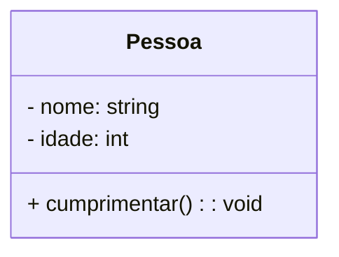
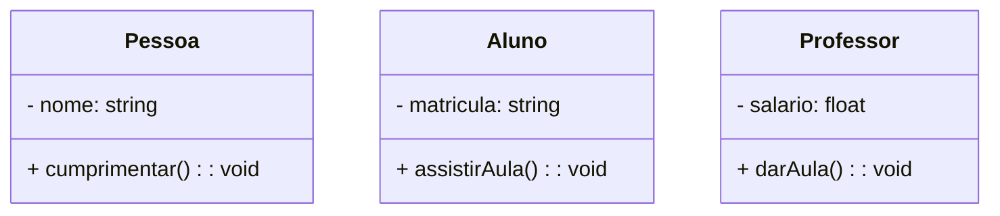
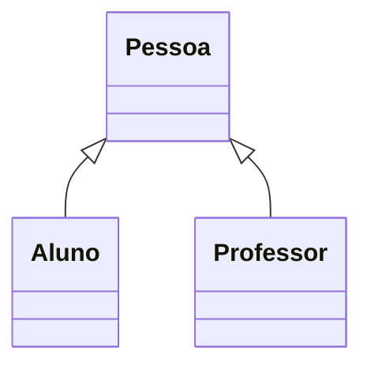
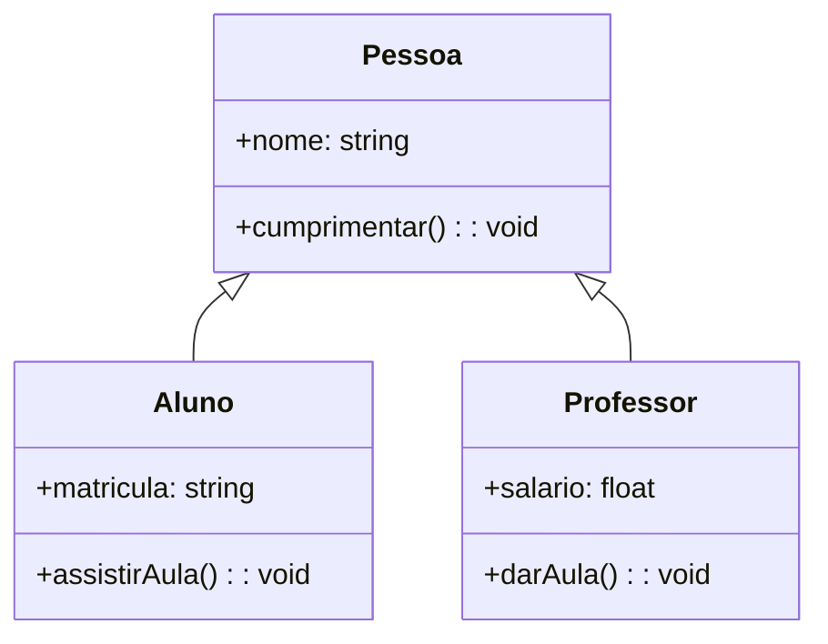
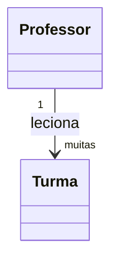
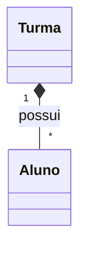
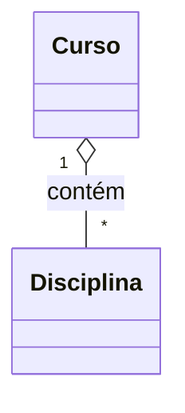
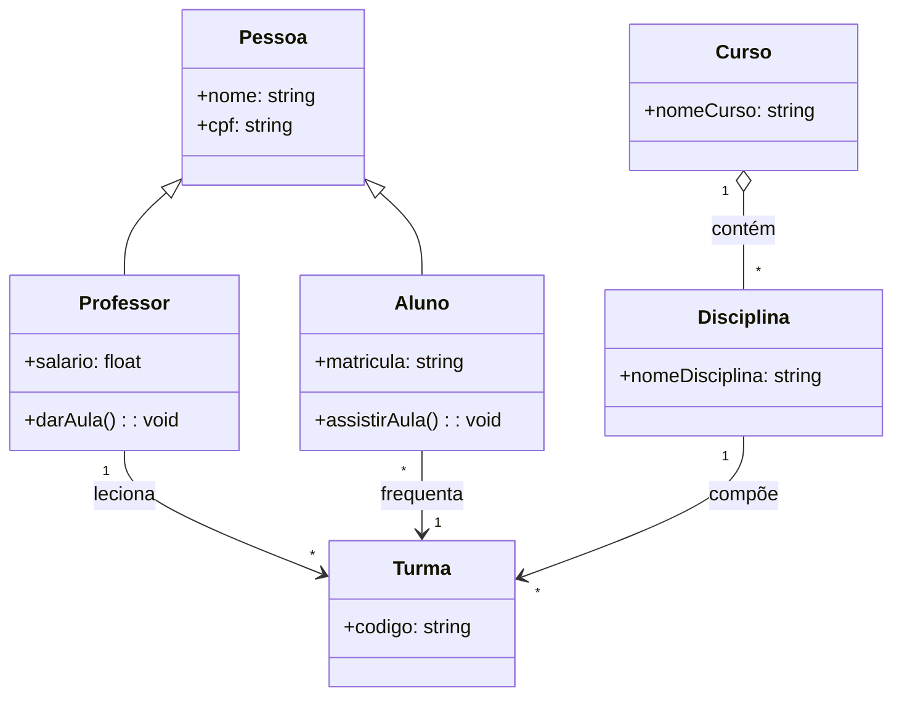
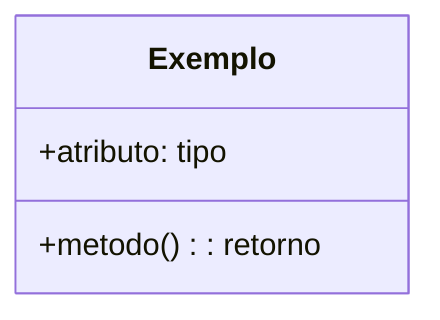

# Aula: Diagramas de Classe com Mermaid no GitHub

## Slide 1: Estrutura Básica de uma Classe


## Slide 2: Múltiplas Classes


## Slide 3: Herança


## Slide 4: Herança com Métodos


## Slide 5: Associação Simples


## Slide 6: Composição (forte)


## Slide 7: Agregação (fraca)


## Slide 8: Diagrama Completo


## Slide 9: Dicas para GitHub
```markdown

```
✅ Coloque isso em arquivos `.md`  
✅ GitHub renderiza automaticamente  
⚠️ Evite acentos ou palavras com `ç` no código
```

## Slide 10: Exercício para os Alunos

Crie no seu repositório um diagrama Mermaid representando:
- Um sistema de biblioteca
- Com as classes: `Livro`, `Autor`, `Usuário`, `Empréstimo`
- Use pelo menos:
  - 1 herança
  - 1 associação
  - 1 composição
